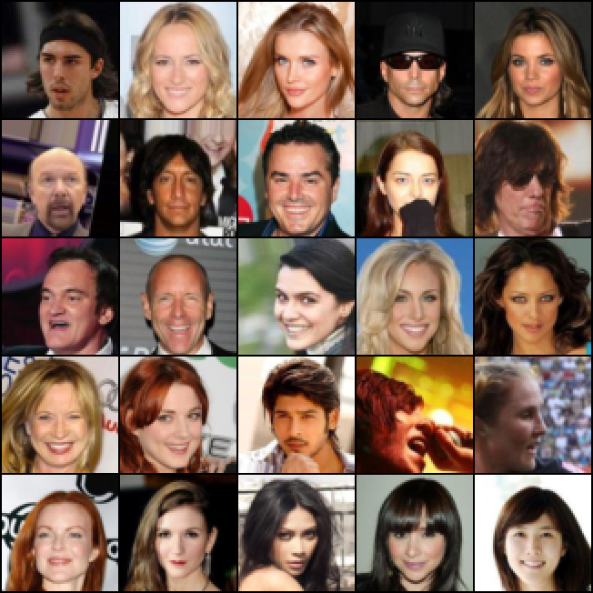
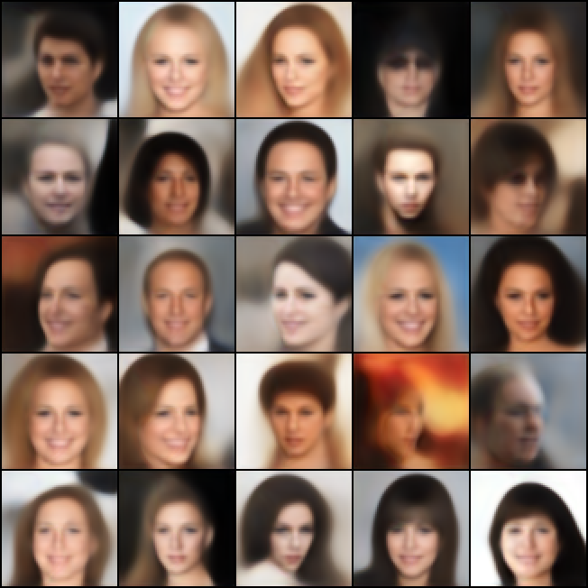
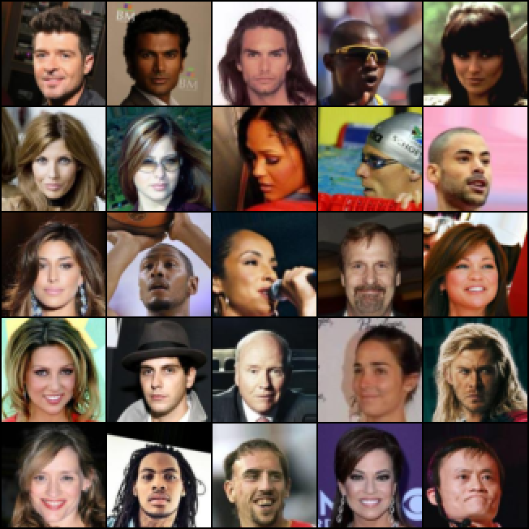
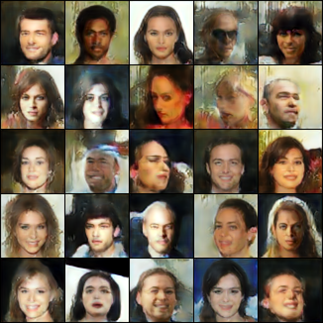

# Neural Optimal Transport Autoencoders

- [Neural Optimal Transport Autoencoders](#neural-optimal-transport-autoencoders)
  - [Installation](#installation)
  - [Prepare](#prepare)
  - [Usage](#usage)
  - [Examples](#examples)
  - [TODO](#todo)


## Installation

Create environment and set dependencies:

```zsh
conda create -n not_ae python=3.8
```

```zsh
curl -sSL https://install.python-poetry.org | python3 -
poetry config virtualenvs.create false

conda activate not_ae
poetry install
```
<!-- conda install tensorflow-gpu==2.4.1 # for TF FID computation -->
Make bash scripts runable 

```zsh
chmod +x -R scripts/*.sh
```

## Prepare

```zsh
python tools/compute_fid_stats.py CelebADataset stats/celeba_fid_stats_{val, test}.npz --split {val, test}
```

```zsh
python tools/compute_fid_stats.py ArtBench10 stats/artbench_fid_stats_{val, test}.npz --split {val, test}
```

## Usage

train baseline:

```zsh
python train.py train configs/train_{celeba / artbench}_{l1 / l2}_ae.yml
```

train NOT-AE:

```zsh
python train.py train configs/train_{celeba / artbench}_{l1 / l2 / perceptual}_cost.yml
```


## Examples

| Method   |      Cost      |  test LPIPS ($\downarrow$)| test FID ($\downarrow$)|
|----------|:-------------:|:------:|------:|
| AE       |  L2            | $0.23$ |  $71.8$      |
| NOT-AE   |    L2          |   $\mathbf{0.14}$ |  $\mathbf{58.4}$      |


Vanilla Autoencoder with MSE loss:

 $\quad$


NOT-Autoencoder with L2 cost: 

 $\quad$



## TODO

* fix artbench (add train / val / test split)
* extend to VAE ?
  

```
@article{korotin2022neural,
  title={Neural optimal transport},
  author={Korotin, Alexander and Selikhanovych, Daniil and Burnaev, Evgeny},
  journal={arXiv preprint arXiv:2201.12220},
  year={2022}
}
```